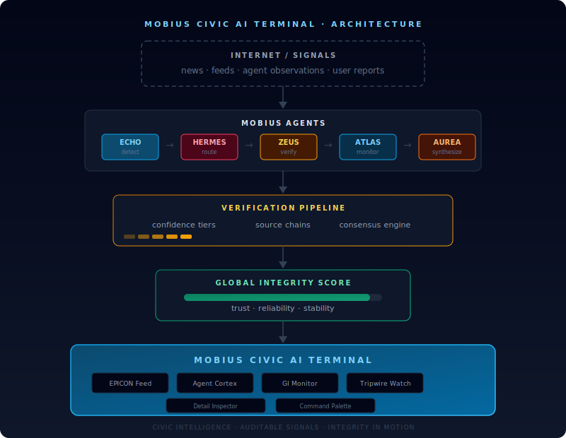

# Mobius Civic AI Terminal

**A civic Bloomberg-style command terminal for the Mobius Substrate.**

The Mobius Civic AI Terminal provides a real-time operational interface for monitoring AI agents, verifying information flows, and tracking integrity signals across a civic AI network.

Think of it as a **Bloomberg Terminal for truth verification and civic intelligence.**

Instead of financial tickers, the terminal monitors:
- AI agents
- information events
- verification pipelines
- global integrity signals
- tripwire alerts



---

## Why This Exists

Modern information systems optimize for speed and amplification, not verification and integrity.

The Mobius Civic AI Terminal is designed to make information **auditable, traceable, and verifiable** before it spreads.

It is part of the broader [Mobius Substrate](https://github.com/kaizencycle), an experimental civic AI infrastructure designed to:
- reduce misinformation amplification
- create transparent verification pipelines
- allow humans and AI agents to collaboratively audit information
- provide integrity metrics for information ecosystems

---

## Core Concepts

### EPICON Feed

EPICON events are structured information events moving through the Mobius verification pipeline. Each event contains a source chain, verification owner, confidence tier, and a trace of which agents handled it.

Example lifecycle:

```
ECHO detects signal → HERMES routes signal → ZEUS verifies sources → ATLAS updates integrity context → AUREA synthesizes outcome
```

### Mobius Agents

The terminal visualizes the current state of eight Mobius agents:

| Agent | Role |
|---|---|
| **ATLAS** | Monitoring and anomaly detection |
| **ZEUS** | Verification engine |
| **HERMES** | Information routing |
| **ECHO** | Ledger recording |
| **AUREA** | Strategic synthesis |
| **JADE** | Annotation and morale layer |
| **EVE** | Ethics observer |
| **DAEDALUS** | Research and build system |

### Integrity Metrics

The system tracks a **Global Integrity Score (GI)** that measures information health across source reliability, institutional trust, consensus stability, and narrative divergence. The goal is not to suppress information but to expose reliability levels transparently.

---

## Terminal Layout

```
┌──────────────────────────────────────────────────────────────────────────────┐
│ MOBIUS TERMINAL                                      C-249 | 07:46 | GI .94 │
│ Alerts 2 | ATLAS OK | ZEUS ACTIVE | ECHO LIVE | HERMES ROUTING | TRIPWIRE N │
├──────────────┬───────────────────────────────────────────────┬───────────────┤
│              │                                               │               │
│  SIDEBAR     │  COMMAND CANVAS                               │  INSPECTOR    │
│              │                                               │               │
│  Pulse       │  ┌─────────────────────────────────────────┐  │  Event Detail │
│  Agents      │  │ EPICON FEED                             │  │  Source Stack │
│  Ledger      │  │ live verified / pending event stream    │  │  Confidence   │
│  Markets     │  └─────────────────────────────────────────┘  │  Agent Trace  │
│  Geopolitics │                                               │  Notes        │
│  Governance  │  ┌─────────────────────────────────────────┐  │               │
│  Reflections │  │ AGENT CORTEX                            │  │               │
│  Infra       │  │ ATLAS ZEUS HERMES ECHO AUREA JADE EVE  │  │               │
│  Search      │  └─────────────────────────────────────────┘  │               │
│              │                                               │               │
│              │  ┌────────────────┬────────────────────────┐  │               │
│              │  │ GI MONITOR     │ TRIPWIRE WATCH         │  │               │
│              │  └────────────────┴────────────────────────┘  │               │
│              │                                               │               │
│              │  ┌─────────────────────────────────────────┐  │               │
│              │  │ COMMAND PALETTE                         │  │               │
│              │  └─────────────────────────────────────────┘  │               │
├──────────────┴───────────────────────────────────────────────┴───────────────┤
│ Ledger Connected · Lab4 OK · Shield OK · Stream Live                         │
└──────────────────────────────────────────────────────────────────────────────┘
```

**Left Panel — Sidebar.** Chamber navigation across Pulse, Agents, Ledger, Markets, Geopolitics, Governance, Reflections, Infrastructure, and Search.

**Center Panel — Command Canvas.** EPICON event feed, Agent Cortex visualization, GI Monitor, Tripwire Watch, and keyboard-first Command Palette.

**Right Panel — Detail Inspector.** Full provenance for any selected event: source stack, confidence ladder, agent trace, and operator notes. Answers the question: *"Why does Mobius believe this?"*

---

## Architecture

```
┌─────────────────────────────────┐
│       INTERNET / SIGNALS        │
│   news · feeds · observations   │
└──────────────┬──────────────────┘
               ▼
┌─────────────────────────────────┐
│        MOBIUS AGENTS            │
│  ECHO → HERMES → ZEUS → ATLAS  │
│  detect   route   verify  scan  │
└──────────────┬──────────────────┘
               ▼
┌─────────────────────────────────┐
│    VERIFICATION PIPELINE        │
│  confidence tiers · consensus   │
│  source chains · tripwires      │
└──────────────┬──────────────────┘
               ▼
┌─────────────────────────────────┐
│     INTEGRITY SCORE (GI)        │
│  trust · reliability · stability│
└──────────────┬──────────────────┘
               ▼
┌─────────────────────────────────┐
│   MOBIUS CIVIC AI TERMINAL      │
│  operator view · audit trail    │
│  command palette · civic map    │
└─────────────────────────────────┘
```

### Tech Stack

| Layer | Stack |
|---|---|
| **Frontend** | Next.js 15, React 19, Tailwind CSS, TypeScript |
| **Backend** | FastAPI, Pydantic, SSE event streaming |
| **Fonts** | JetBrains Mono (data) + IBM Plex Sans (interface) |
| **Infra** | Vercel (frontend) + Render (API) |

### Color Language

| Color | Meaning | Agent |
|---|---|---|
| Sky / Blue | System | ATLAS |
| Amber | Verification / caution | ZEUS |
| Rose | Routing / pressure | HERMES |
| Slate | Memory / archive | ECHO |
| Orange | Strategy / synthesis | AUREA |
| Emerald | Integrity / nominal | JADE |
| Fuchsia | Observer / governance | EVE |
| Yellow | Research / build | DAEDALUS |
| Red | Alert / contradicted | — |

---

## API Endpoints

| Endpoint | Purpose |
|---|---|
| `GET /api/v1/agents/status` | Agent Cortex state |
| `GET /api/v1/epicon/feed` | EPICON event stream |
| `GET /api/v1/integrity/current` | GI snapshot |
| `GET /api/v1/tripwires/active` | Active tripwires |
| `GET /api/v1/system/health` | Service health |
| `GET /api/v1/stream/events` | SSE live updates |

Without a configured API, the terminal falls back to mock data automatically.

---

## Local Development

### Frontend

```bash
npm install
npm run dev
# Open http://localhost:3000/terminal
```

### Backend (optional)

```bash
cd api
python -m venv .venv
source .venv/bin/activate
pip install -r requirements.txt
uvicorn app.main:app --reload --host 0.0.0.0 --port 8000
# Docs at http://localhost:8000/docs
```

### Environment

Create `.env.local` from `.env.example`:

```
NEXT_PUBLIC_MOBIUS_API_BASE=http://localhost:8000/api/v1
```

---

## Command Palette

The terminal includes a keyboard-first command interface:

| Command | Action |
|---|---|
| `/help` | List all available commands |
| `/scan [term]` | Search across events, agents, tripwires |
| `/agents [name]` | Show agents or inspect a specific one |
| `/tripwires [id]` | Show tripwires or inspect one |
| `/gi` | Open governance integrity view |
| `/pulse` | Switch to Pulse chamber |
| `/markets` | Switch to Markets chamber |
| `/ledger` | Switch to Ledger chamber |
| `/geo` | Switch to Geopolitics chamber |
| `/governance` | Switch to Governance chamber |
| `/settings` | Switch to Settings chamber |

---

## Roadmap

**V1** — Terminal layout, mock civic API, EPICON event feed, agent visualization, interactive panels *(current)*

**V2** — Live event streaming, Mobius agent orchestration, tripwire alert engine

**V3** — Civic dashboards, verification consensus voting, public integrity explorer

---

## Project Status

Experimental civic infrastructure project. The Mobius Civic AI Terminal is a prototype interface exploring how AI systems and humans might collaboratively monitor information integrity.

**Live deployment:** [mobius-civic-ai-terminal.vercel.app/terminal](https://mobius-civic-ai-terminal.vercel.app/terminal)

---

## License

MIT
